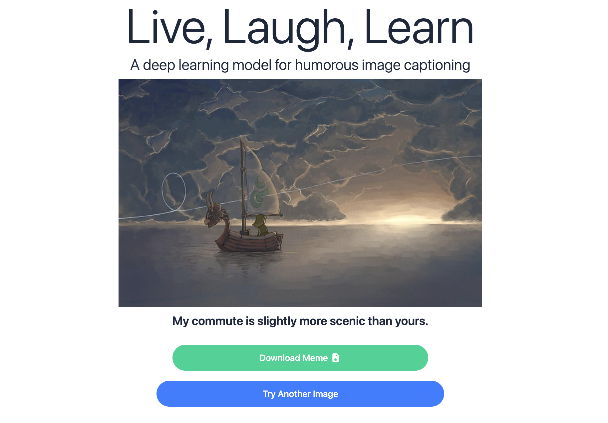

# Live, Laugh, Learn: A deep learning model for meme captioning
This project uses deep learning and computer vision to create a meme caption for a user-inputted image. 

Website **available** at **https://hishambhatti.github.io/meme-generator**

Designed by Hisham Bhatti, Samarjit Kaushik, Parum Misri, and Rishit Khare.

## Purpose

This repo is an extension to our final project in CSE 599: Deep Learning. During that course, my partners (Samarjit Kaushik, Parum Misri) and I trained and deployed a model that would take an input image and spit out a humorous image. After much training and refining, the end model was funny... though maybe not always original.

Afterwards, I wanted to deploy this model to the Internet so that family and friends (and potential future employers 👀) could view our project and play around with our creation. With the help of Rishit Khare, we have finally deployed this app live on the Internet. So feel free to play around with it!

## Details

The details of how our model works internally can be found in this paper! It also discusses some challenges with training and evaluating our model. As for the meme generator frontend, note that at the moment, any picture you send will be cropped from the center to be a square. 

## Favorite Pics

Here is a gallery of some of my favorite generated captions:

|  |  |
| :---: | :---: |

|  |  |
| :---: | :---: |

|  |  |
| :---: | :---: |

### Tools

Languages: Jupyter Notebook, Python, Javascript/Typescript, CSS, HTML
Libraries: PyTorch
Frameworks: Flask, React, Tailwind CSS
Developer Tools: Google Cloud (for backend server), Git, Github

### Credit

* **Creators**: Hisham Bhatti, Samarjit Kaushik, Parum Misri, and Rishit Khare (for full-stack deployment)
* Thanks to Prof. Ranjay Krishna and the entire CSE 599 G staff!
